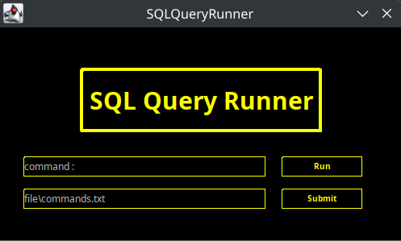
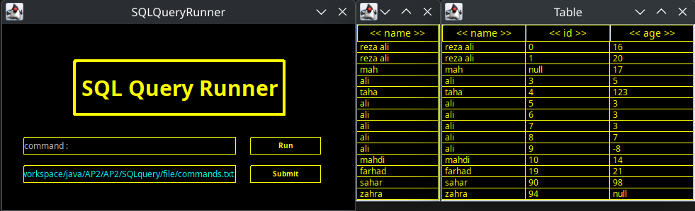

# Mini-Database-Management-System-CRUD-Advanced-Programming-Project-2

> ## 📌 Overview

This project is a lightweight, Java-based simulation of a **relational database system**, developed as part of the Advanced Programming course. It demonstrates how core SQL operations—**CREATE**, **READ**, **UPDATE**, and **DELETE** (CRUD)—can be implemented from scratch using file handling techniques in Java.

The system is designed to mimic basic **MySQL-style** commands.

## ✅ Features

*  **CREATE**: Define and initialize tables with specific structures.
*  **READ**: Retrieve and display records based on custom queries.
*  **UPDATE**: Modify existing records with new values.
*  **DELETE**: Remove individual entries or entire datasets.
*  Basic validation to ensure command correctness and data integrity.
*  Error messages for invalid or out-of-sequence operations (e.g., querying before table creation).

# Pictures

